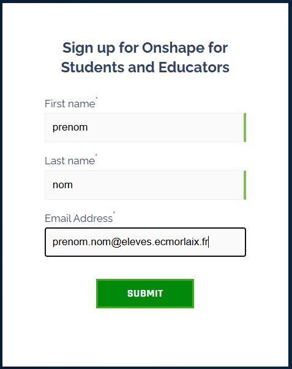
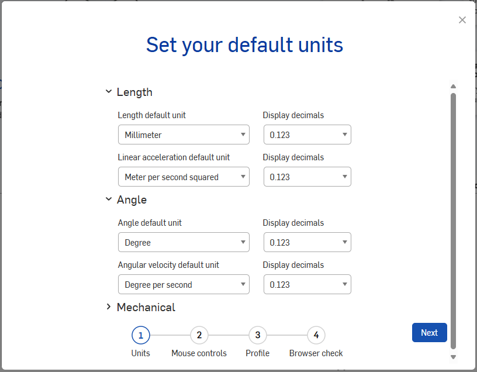
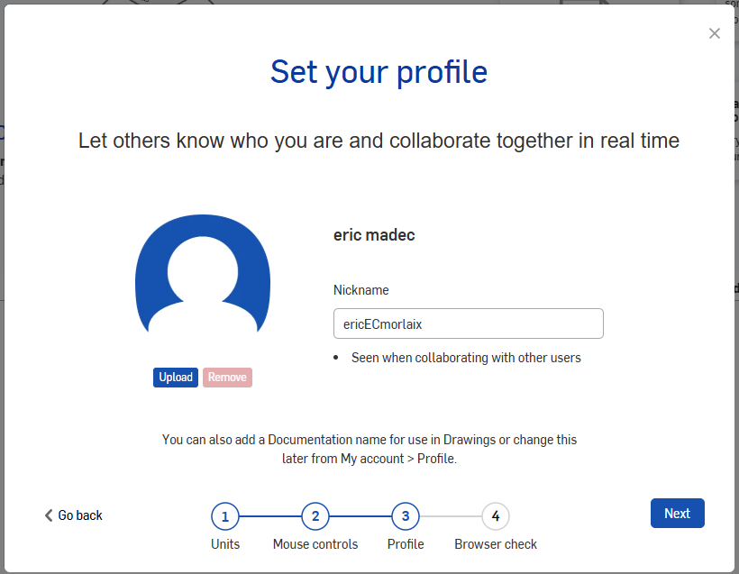

[{.center}](https://www.onshape.com/fr/){target=_blank} 

[Onshape](https://www.onshape.com/fr/){target=_blank} est une application web qui permet de modéliser en 3D à la manière de SolidWorks mais dans un navigateur. Elle sera donc disponible sur l’ensemble de vos appareils (ordinateur, tablette, smartphone) tant au lycée qu’en dehors.

Pour utiliser Onshape, et bénéficier gratuitement d’un compte professionnel pour l’éducation, il faut s'inscrire...

> Educator et student ont les mêmes possibilités qu’un compte PRO. Pour un compte Education, le logo EDU apparaîtra sur tous les documents.

## Inscription

Rendez-vous sur le site <https://www.onshape.com/en/education/sign-up> et renseigner alors tous les champs des formulaires des fenêtres successives...

{.center width=40%}
***
{.center width=80%}
***
{.center width=60%}
***
<!-- {.center width=60%} -->
{.center width=70%}

Ensuite, il faut valider l'inscription depuis le mail reçu et définir un mot de passe...

{.center width=70%}

Une fois le compte activé, on est invité à configurer certains paramètres...

{.center width=50%}
{.center width=50%}
{.center width=50%}

A partir du menu déroulant en haut à droite, en cliquant sur "My account", on ouvre une fenêtre qui permet de gérer toutes les préférences à partir du menu listé à gauche...

{.center width=100%}

## Prise en main

- [Débuter avec Onshape](https://docs.google.com/presentation/d/e/2PACX-1vSKZUCKzhLDD6lVvwX7lwcDLhSoIda_xufBa-izT42tnKjOP8FEkU6ODuqiiV-NtAvBWV8zkZkR7yVX/pub?start=false&loop=false&delayms=3000&slide=id.g13619769a06_0_0){target=_blank}

- [Créer une pièce par extrusion](https://perso.crans.org/geneau/NewCligne/ressources/Video_Onshape/Cr%C3%A9er%20une%20pi%C3%A8ce%20par%20extrusion.mp4){target=_blank}

- [Créer une pièce par révolution](https://perso.crans.org/geneau/NewCligne/ressources/Video_Onshape/Créer une pièce par révolution.mp4){target=_blank}

Par la suite, pour modéliser avec Onshape il suffit de s'identifier à l'adresse <https://cad.onshape.com/signin>

## Tutoriels

Des tutoriels pour Onshape sont disponibles sur les sites :

- <https://sites.google.com/view/newecligne/onshape>{target=_blank}
- <https://learn.onshape.com/>{target=_blank}

## Ressources :

<ul>
    <li>
        <a href="https://www.youtube.com/channel/UCTvd5lUSLtTH8Qcd7Pl1nQg" target="_blank">Une chaine Youtube</a> ;
    </li>
    <li>
        <a href="https://forum.onshape.com/" target="_blank">Un forum</a>
    </li>
    <li>
        <a href="https://forum.onshape.com/discussion/comment/21462#Comment_21462" target="_blank">Un groupe d'utilisateur francophone​</a>
    </li>
</ul>

- [eduscol_ressources-pedagogiques_onshape-modeleur-3d](https://eduscol.education.fr/sti/ressources_pedagogiques/onshape-modeleur-3d-saas-presentation-0#description){target="_blank"}

- [cours de modélisation 3D de M. Lossendière​​](https://scenari.techno-melh.xyz/modelisation-3d/co/modelisation-3D-MELH.html){target="_blank"}

- [onshape-un-logiciel-professionnel-de-modelisation-3d-innovant-et-gratuit-pour-un-usage-pedagogique](https://blogpeda.ac-poitiers.fr/lp2i-si/2016/09/09/onshape-un-logiciel-professionnel-de-modelisation-3d-innovant-et-gratuit-pour-un-usage-pedagogique/){target="_blank"}
    

    
