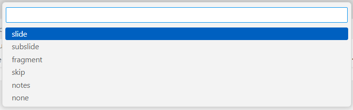
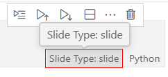

Voici quelques solutions pour produire un diaporama de présentation

## Jupyter notebook

### Interface dédiée [Carnets, Basthon, ...](https://nbviewer.org/urls/ericecmorlaix.github.io/bn/Slide-Le_BN_pour_presenter.ipynb){target=_blank}

### Visual Studio Code

#### Préalable

La première chose est de s'assurer que l'extension [Jupyter Slide Show](https://marketplace.visualstudio.com/items?itemName=ms-toolsai.vscode-jupyter-slideshow){target=_blank} est installée et activée.

{.center}

#### Paramétrage des cellules

Pour ajouter un **`Slide Type`** (type de diapo) à une cellule, à partir des trois petits points de son menu, choisir **`Switch Slide Type`**

{.center}

{.center}

Lorsqu'un type de diapo est indiqué dans une cellule, il suffit de cliquer dessus pour le modifier selon le besoin

{.center}

#### Visualiser et exporter le diaporama

Dans un terminal, cheminer jusqu'au dossier contenant votre notebook (`cd chemin/dossier`), puis saisir l'instruction : `jupyter nbconvert 'nom_du_notebook.ipynb' --to slides --post serve`.

Cela démarre un serveur et ouvre dans votre navigateur un onglet pour afficher le notebook en mode slide show.

En fait, cela génère aussi un fichier HTML autonome qu'il est alors possible de publier sur le web par exemple depuis votre dépot GitHub nommé `username.github.io` comme [https://ericecmorlaix.github.io/dia/Slide-Le_BN_pour_presenter.html](https://ericecmorlaix.github.io/dia/Slide-Le_BN_pour_presenter.html){target=_blank}.

???- tip "On peut alors l'intégrer depuis une cellule de code d'un notebook"
    === "Code Python"
        ```Python
        %%HTML
        <center>
        <iframe width="560" height="420" src="https://ericecmorlaix.github.io/dia/Slide-Le_BN_pour_presenter.html" title="Exemple de diaporama généré depuis un notebook" ></iframe>
        </center>   
        ```
    === "Code alternatif"
        ```Python
        from IPython.display import HTML
        HTML("""<center>
                  <iframe width="560" height="420" src="https://ericecmorlaix.github.io/dia/Slide-Le_BN_pour_presenter.html" title="Exemple de diaporama généré depuis un notebook" ></iframe>
                </center>""")
        ```
    === "Rendu HTML"
        <center>
            <iframe width="560" height="420" src="https://ericecmorlaix.github.io/dia/Slide-Le_BN_pour_presenter.html" title="Exemple de diaporama généré depuis un notebook" ></iframe>
        </center>

## Fichier MarkDown

### VSCode [Markdown Preview Enhanced](https://shd101wyy.github.io/markdown-preview-enhanced/#/presentation){target=_blank}

### VSCode [Marp](https://marketplace.visualstudio.com/items?itemName=marp-team.marp-vscode){target=_blank}

### [Obsidian](https://ericecmorlaix.github.io/adn-Tutoriel_Obsidian/6a-Exports/#diaporama){target=_blank}

