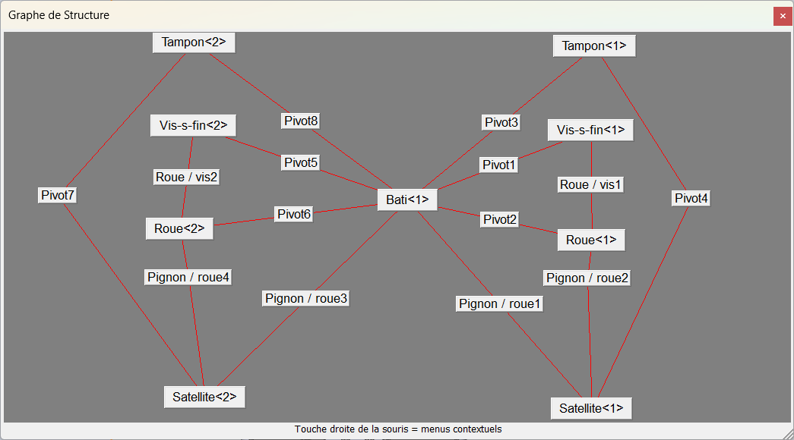

[Sujets Banque Sciences de l'ingénieur - Pratique](https://sujets.examens-concours.gouv.fr/delos/public/bgt/si)

[Drive de Baptiste Louvion avec tableau d'inventaire](https://drive.google.com/drive/folders/1ULtaW-aLMbFtW0mm0t3ax49xv81JaizQ?fbclid=IwY2xjawIZhmJleHRuA2FlbQIxMAABHWyv3AMvSFY2Jzc5ag8s47wOVMnFLxCLQR3-U86RTrRla9LrRuJJhMynSw_aem_f6ULwgXwP2lvzg0lXKw5lg)

|n° |système|sujet|performance|SW-M3D|Scilab-Xcos|Open Modelica|Commentaire| Faisabilité |
|:-:|:------:|:--:|:----:|:----:|:---------:|:-------:|:-:|:-:|
|2  |MetaBird |A |fréquence battement d'ailes| OK TODO adptation minime ressource | ||Téléphone à tester et boîte à créer | ~ |
| | |B |amplitude battement d'ailes| OK TODO adptation minime ressource | | |Téléphone à tester | ~ |
| | |C |autonomie énergétique|  | TODO Modèle Matlab à adapter | ? |Maquette et multimètre à tester | |
|5 | Distributeur de savon  No Touch |A |quantité de savon| | OK sur V5.5.2 | |Protocole à tester | ~ |
| | |B |autonomie énergétique| | |OK [avec modifications](#05b) | Protocole à tester | ~  |
|6|Tensiomètre - Spengler Auto Tensio |A |débit d’air| | OK sur V5.5.2 | |Protocole à tester | ~  |
| | |B |autonomie énergétique| | | PB de compatibilité, modèle de "ouf" avec arduino... | | |
| | |C |temps de cycle de mesure| | | PB de compatibilité, modèle de "ouf" avec arduino... | | |
|30|Slider CREA |A |vitesse rapide ||OK sur V5.5.2 | |Multimètre (Umot) et Maquette à tester | ~  |
| | | B|vitesse précision| |OK sur V5.5.2| |Maquette à tester | ~  |
| | | C|vitesse lente| |OK sur V5.5.2| |Maquette à tester | ~  |
| | | | || | | | |
| | | | || | | | |

### Notes :

#### **05B**
Le modèle Open Modelica fourni dans la banque ne correspond pas exactement avec  celui affiché dans le document ressource il manque le calcul du courant moyen et il y a la modélisation du piston en plus. Aussi, j'ai du remplacer le bloc emf non reconnu. Mon temps de cycle simulé est de 2,709s, il faut donc régler le temps de simulation sur 3s pour l'atteindre et adapter la valeur de la constante pour le calcul du courant moyen (k=2,709) on trouve Imoy=0,52A

