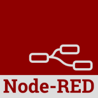
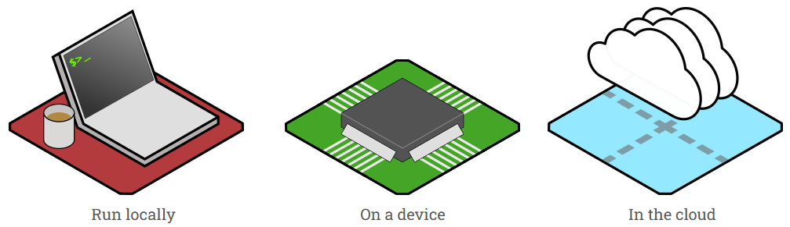
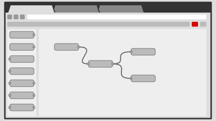

https://nodered.org/docs/tutorials/

http://silanus.fr/sin/?s=node+red

http://silanus.fr/bts/formationIOT/node-red/nodered.pdf

https://www.reseaucerta.org/sites/default/files/decouverte_de_la_programmation_low_code_node-red.pdf

## PRÉSENTATION

Node-Red est un langage de développement graphique créé par IBM, au début de l'année 2013.

Son objectif est de permettre à quiconque de créer des applications qui collectent, transforment et visualisent des données de l'Internet des Objets (IoT = Internet of Things).  
Sa nature low-code le rend accessible aux utilisateurs de tout horizon, qu'il s'agisse d'automatisation domestique ou de systèmes de contrôle industriels.

Il fait désormais partie de la fondation JS depuis 2016 et est diffusé en open-source.
## FONCTIONNEMENT

L'éditeur graphique est un service disponible dans un navigateur (coté client), mais l'ensemble s'appuie sur NodeJS pour l'exécution (côté serveur) tirant pleinement parti de son modèle non bloquant piloté par les événements. Cela le rend idéal pour fonctionner à la périphérie du réseau sur un serveur d’application qui peut être un matériel à faible coût tel que le Raspberry Pi ou un serveur dans le cloud.

Dans Node-red, la programmation simplifiée se fait grâce à des blocs de code prédéfinis, appelés `nodes` pour effectuer des tâches.
Les noeuds connectés, généralement une combinaison de noeuds d’entrée, de noeuds de traitement et de noeuds de sortie, lorsqu’ils sont câblés ensemble, constituent un `flow`.

 ## Installation

 Consultez le guide de démarrage de node-red pour procéder à l’installation qui correspond à votre cas.
https://nodered.org/docs/getting-started

 

BBC microbit + Node Red en série
https://www.youtube.com/playlist?list=PLCIxRgM2bXnX-glvCNSwPqBWnN4ZJ57Mq

https://funprojects.blog/2020/02/03/microbits-and-node-red/