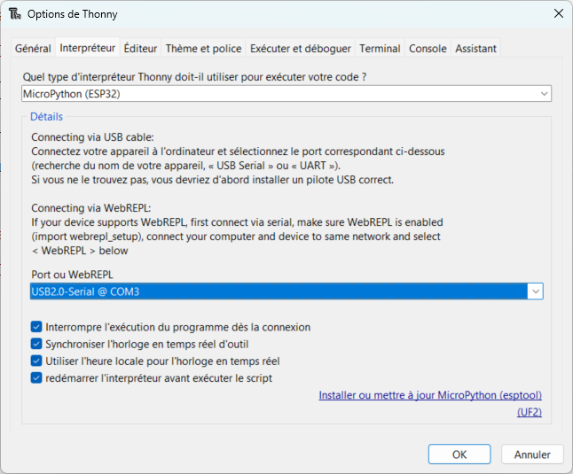
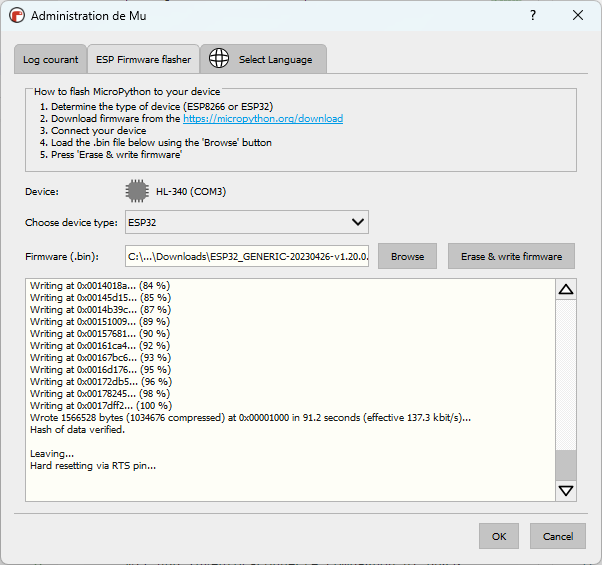
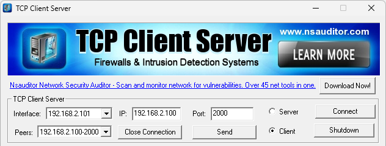

## Préparation de l'ESP32 pour MicroPython

### Avec le logiciel [Thonny](https://thonny.org){target=_blank}

- **Installer** la dernière version du logiciel ;
- **Connecter** la carte ESP32 à votre PC via un cable USB ;
- **Démarrer** Thonny ;
- Dans le menu horizontal, **cliquer** sur `Exécuter` et **choisir** `Configurer l'interpréteur` ;
- **Choisir** le type d'interpréteur et le port série correspondants à la carte ;
- **Cliquer** sur le lien `Installer ou mettre à jour MicroPython (esptool)` ;

{.center}

- **Renseigner** tous les champs (*lire les inscriptions idoines sur le µC*) puis **cliquer** sur `Installer` ;

{.center}

> Si tout se passe bien, le prompt de l'interpréteur MicroPython doit apparaitre en console...

### Avec le logiciel [Mu](https://codewith.mu/en/download){target=_blank}

- **Installer** la dernière version du logiciel ;
- **Connecter** la carte ESP32 à votre PC via un cable USB ;
- **Démarrer** Mu Editor  et **Choisir** le mode `ESP MicroPython` ;
- **Cliquer** sur le rouage tout en bas à droite et **choisir** l'onglet `ESP Firmware flasher` puis **Suivre** les instructions...  ;

{.center}

> Si tout se passe bien, **cliquer** sur le bouton `REPL` du menu et le prompt de l'interpréteur MicroPython doit apparaitre en console...

## Connecter l'ESP32 à un point d'accès

> Point d'accès = un réseau WLAN avec un des routeurs du labo de SI, un partage de connexion à votre smartphone...

- **Saisir** le programme MicroPython suivant :
```Python
# ESP32 : connexion à un point d'accès Wifi
import network
import time
import ubinascii
wlan = network.WLAN(network.STA_IF)  # On créer l'objet wlan pour gérer la connexion
wlan.active(True) # Activation de l'interface
if not wlan.isconnected() :  # On vérifie qu'on n'est pas déjà connecté
    print("Connexion au point d'accès...")
    # On demande une connexion en renseignant l'identifiant et le mot de passe du point d'accès
    wlan.connect('SSID', "Code")
    # Boucle d'attente...
    while not wlan.isconnected() :
        print('Connexion en cours...')
        time.sleep(0.5)
# Confirmation de connexion
print("Connecté en Wifi au point d'accès")
# Affiche l'adresse logique que l'ESP32 à obtenu du DHCP
print("Adresse IP de l'ESP32 = ", wlan.ifconfig()[0])
# Affiche l'adresse physique de l'ESP32
print("Adresse MAC de l'ESP32 = ", ubinascii.hexlify(wlan.config('mac')).decode('utf-8'))
```

<!-- ```Python
import network
import time
import ubinascii
wlan = network.WLAN(network.STA_IF)  # On créer l'objet wlan pour gérer la connexion
wlan.active(True) # Activation de l'interface
if not wlan.isconnected() :  # On vérifie qu'on n'est pas déjà connecté
    print("Connexion au point d'accès...")
    # On demande une connexion au point d'accès
    wlan.connect('WIFI_SI2', 'wifisi02')
    # Boucle d'attente...
    while not wlan.isconnected() :
        print('Connexion en cours...')
        time.sleep(0.5)
# Confirmation de connexion
print("Connecté en Wifi au point d'accès")
# Affiche l'IPV4 que l'ESP32 à obtenu du DHCP
print("Adresse IP de l'ESP32 = ", wlan.ifconfig()[0])
# Affiche l'adresse MAC de l'ESP32
print("Adresse MAC de l'ESP32 = ", ubinascii.hexlify(wlan.config('mac')).decode('utf-8'))
``` -->


??? example "A expérimenter..."

    - Saisir l'instruction `wlan.ifconfig()` dans l'interpréteur pour obtenir plus d'informations concernant le réseau ;
    - Configurer une autre adresse IP statique compatible avec l'instruction `wlan.ifconfig('IP statique', 'Masque', 'IP Passerelle', 'IP DNS')`
    - Quelle instruction permet d'obtenir l'adresse de la passerelle ?
    - Tester la connexion de l'ESP32 vers la passerelle à l'aide du module [uping.py](./uping.py) à installer dans les fichiers de l'ESP32

    ```python
    import uping
    uping.ping('IP de la passerelle')
    ```
    - Améliorer l'affichage de l'adresse MAC ;
    - En cas d'erreur de saisi ou d'indisponibilité du point d'accès on rentre dans une boucle infinie, améliorer le script pour limiter le délai d'attente à 30 secondes...   
    - Scanner les point d'accès Wifi disponible avec l'instruction `wlan.scan()`
    ...
    

## Communication TCP Client/Serveur

### Serveur = ESP32

- **Saisir** le programme MicroPython suivant sur l'ESP32 :

```Python
# ESP32 : programme pour serveur
import network
import socket
import time
import ubinascii
wlan = network.WLAN(network.STA_IF)  # On créer l'objet wlan pour gérer la connexion
wlan.active(True) # Activation de l'interface
if not wlan.isconnected() :  # On vérifie qu'on n'est pas déjà connecté
    print("Connexion au point d'accès...")
    # On demande une connexion au point d'accès
    wlan.connect("SSID", "Code")
    # Boucle d'attente...
    while not wlan.isconnected() :
        print('Connexion en cours...')
        time.sleep(0.5)
# Confirmation de connexion
print("Connecté en Wifi au point d'accès")
# Affiche l'IPV4 que l'ESP32 à obtenu du DHCP
print("Adresse IP de l'ESP32 = ", wlan.ifconfig()[0])
# Affiche l'adresse MAC de l'ESP32
print("Adresse MAC de l'ESP32 = ", ubinascii.hexlify(wlan.config('mac')).decode('utf-8'))
# Partie serveur
s = socket.socket()
s.setsockopt(socket.SOL_SOCKET, socket.SO_REUSEADDR, 1)
# Le serveur écoutera le port 2000 un client à la fois
s.bind(('0.0.0.0', 2000))
s.listen(1)
# Attente d'un client
res = s.accept()
client_s = res[0]
client_adresse = res[1] # IP du client
print("Adresse IP du client : ", client_adresse)
requete = ''
# Boucle tant que le client n'a pas envoyé "stop"
while not (requete == "stop\r") :
    # lecture de la requete du client
    requete = client_s.recv(1024).decode('utf-8')
    if requete == "" :  # le client se déconnecte
        requete = 'stop\r'
    else :
        # On affiche en console la requete du client
        print(requete)
# On ferme la communication avec le client
client_s.close()
# On ferme le socket
s.close()
```

<!--     
```
import network
import socket
import time
import ubinascii
wlan = network.WLAN(network.STA_IF)  # On créer l'objet wlan pour gérer la connexion
wlan.active(True) # Activation de l'interface
if not wlan.isconnected() :  # On vérifie qu'on n'est pas déjà connecté
    print("Connexion au point d'accès...")
    # On demande une connexion au point d'accès
    wlan.connect('WIFI_SI2', 'wifisi02')
    # Boucle d'attente...
    while not wlan.isconnected() :
        print('Connexion en cours...')
        time.sleep(0.5)
# Confirmation de connexion
print("Connecté en Wifi au point d'accès")
# Affiche l'IPV4 que l'ESP32 à obtenu du DHCP
print("Adresse IP de l'ESP32 = ", wlan.ifconfig()[0])
# Affiche l'adresse MAC de l'ESP32
print("Adresse MAC de l'ESP32 = ", ubinascii.hexlify(wlan.config('mac')).decode('utf-8'))
# Partie serveur
s = socket.socket()
s.setsockopt(socket.SOL_SOCKET, socket.SO_REUSEADDR, 1)
# Le serveur écoutera le port 2000 un client à la fois
s.bind(('0.0.0.0', 2000))
s.listen(1)
# Attente d'un client
res = s.accept()
client_s = res[0]
client_adresse = res[1] # IP du client
print("Adresse IP du client : ", client_adresse)
requete = ''
# Boucle tant que le client n'a pas envoyé "stop"
while not (requete == "stop\r") :
    # lecture de la requete du client
    requete = client_s.recv(1024).decode('utf-8')
    if requete == "" :  # le client se déconnecte
        requete = 'stop\r'
    else :
        # On affiche en console la requete du client
        print(requete)
# On ferme la communication avec le client
client_s.close()
# On ferme le socket
s.close()


```
 -->

### Clients = [PC, Raspberry PI, ESP32]


- **Démarrer** le logiciel TCP Client Server sur un PC connecté au même réseau que l'ESP32 ;
- **Cocher** la case `Client` ;
- **Renseigner** l'adresse IP du serveur dans la case `IP` et **préciser** le `Port` de communication choisi ;
- **Cliquer** sur le bouton `Connect` ;

{.center}

- **Transmettre** vos demandes au serveur en cliquant sur le bouton `Send` ;
- **Vérifier** leur bonne réception en console ;
- **Couper** la connexion en cliquant sur le bouton `Close Connection` ;
- **Vérifier** l'arrêt du serveur...


???- example "Client en Python sur PC ou Raspberry Pi"

    ```Python
    # Python programme pour client
    import socket
    IP = '192.168.2.100'  # IP du serveur
    PORT = 2000 # Port choisi

    s = socket.socket()  # création du socket
    s.connect((IP,PORT))  # connection au serveur
    demande=""
    while not (demande == b"stop\r\n") :
        demande = input('Demande à envoyer = ')
        demande = str.encode(demande + "\r\n")
        s.send(demande) # envoi le message
        # reponse_serveur = s.recv(1024).decode('utf-8')
        # print('Réponse serveur = ', reponse-serveur)
    s.close() # fermeture de la communication
    ```

???- example "Client en MicroPython sur ESP32"

    ```Python
    # ESP32 : programme pour serveur
    import network
    import socket
    import time
    import ubinascii
    wlan = network.WLAN(network.STA_IF)  # On créer l'objet wlan pour gérer la connexion
    wlan.active(True) # Activation de l'interface
    if not wlan.isconnected() :  # On vérifie qu'on n'est pas déjà connecté
        print("Connexion au point d'accès...")
        # On demande une connexion au point d'accès
        wlan.connect("SSID", "Code")
        # Boucle d'attente...
        while not wlan.isconnected() :
            print('Connexion en cours...')
            time.sleep(0.5)
    # Confirmation de connexion
    print("Connecté en Wifi au point d'accès")
    # Affiche l'IPV4 que l'ESP32 à obtenu du DHCP
    print("Adresse IP de l'ESP32 = ", wlan.ifconfig()[0])
    # Affiche l'adresse MAC de l'ESP32
    print("Adresse MAC de l'ESP32 = ", ubinascii.hexlify(wlan.config('mac')).decode('utf-8'))
    # Partie client
    s = socket.socket()
    # On renseigne l'IP du serveur et le Port choisi
    ip_serveur = '192.168.2.100'
    port = 2000
    # Connexion au serveur
    s.connect((ip_serveur, port))
    s.send("message de demande")
    # reponse_serveur = s.recv(1024).decode('utf-8')
    # print('Réponse serveur = ', reponse-serveur)
    s.close()
    ```

## Communication HTTP et IOT avec l'ESP32


### Page web affichant la valeur d'un capteur analogique

**Connecter** un potentiomètre sur l'entrée `I35` de l'ESP32 et y **Saisir** le programme MicroPython suivant : 

```Python
import network
import time
import ubinascii
Try :
    import usocket as socket
except :
    import socket

# On définit l'entrée analogique utilisée
capt_analog = ADC(Pin(35)) # on crée l'objet connecté sur la broche 35
capt_analog.width(ADC.WIDTH_12BIT) # Pour 4096 valeurs
capt_analog.atten(ADC.ATTN_11DB)

# Code HTML de la page Web renvoyée par le serveur
html = b"""<!DOCTYPE html>
<html>
    <head>
        <title>ESP32 capteur analogique</title>
    </head>
    <body>

    </body>
... A compléter...
```

### Page web avec bouton et LED

<center>
<iframe width="560" height="315" src="https://www.youtube-nocookie.com/embed/pAsQ8zZCcHo?si=Fjo_8NG0JI795LzQ" title="YouTube video player" frameborder="0" allow="accelerometer; autoplay; clipboard-write; encrypted-media; gyroscope; picture-in-picture; web-share" allowfullscreen></iframe>
</center>

## Ressources :

- Ressource officiel en Anglais : <https://docs.micropython.org/en/latest/esp32/quickref.html#>{target=_blank}
- Non officielle mais en Français  : <https://micropython.fr/>{target=_blank} (par Xavier HINAULT) 

- Pour la SoproLab :
    - <https://j-chouteau.org/carte-soprolab>{target=_blank}
    - <https://github.com/SoproLab/Soprolab>{target=_blank}


- */!\ site avec beaucoup de pub :* <https://www.robotique.tech/tutoriel/construction-des-objets-connectes-bases-sur-la-carte-esp32/>


