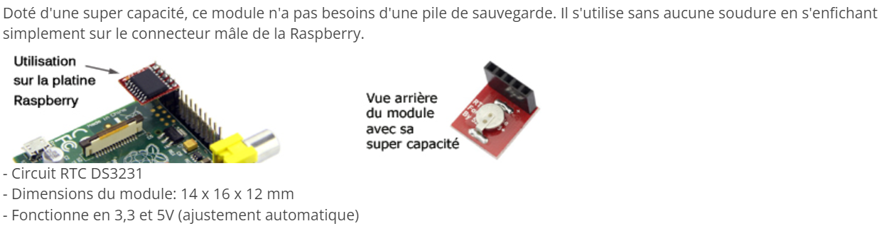
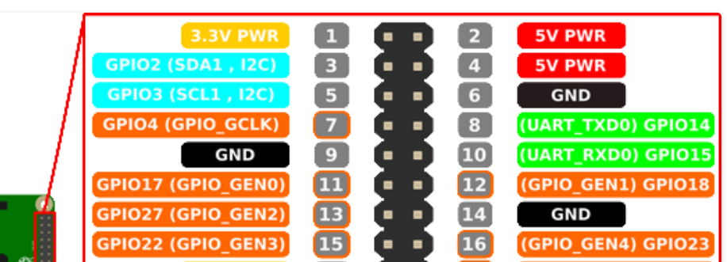

# Pi Pico

## Broches Pi Pico W


## Démarrage en MicroPython

- Télécharger le firmeware adapté au Raspberry Pi Pico W (avec Wi-Fi et Bluetooth LE) : <https://micropython.org/download/rp2-pico-w/rp2-pico-w-latest.uf2>{target=_blank}
- Maintenir appuyé le bouton `BOOT` tout en connectant l'USB au PC ;
- Glisser/déposer le fichier du firmware sur le lecteur `RPI-RP2 (E:)` ;


> [Source](https://www.raspberrypi.com/documentation/microcontrollers/micropython.html#drag-and-drop-micropython){target=_blank}

### Avec Thonny

- Démarrer le logiciel `Thonny` puis cliquer dans le menu sur `Exécuter` pour choisir le bon interpréteur et le port connecté ;

{.center width=80%}

- Enregistrer en `main.py` le code suivant pour tester la LED intégrée sur la Pi Pico W :

```Python
# Blink en boucle infinie
from machine import Pin
from utime import sleep

pin = Pin("LED", Pin.OUT) # "LED" désigne la led built-in

print("LED starts flashing...")
while True:
    try:
        pin.toggle() # bascule d'un état à l'autre
        sleep(1) # pause de 1 seconde
    except KeyboardInterrupt:
        break
pin.off()
print("Finished.")
```

> Spécificité pour la LED embarquée sur la Pi Pico W cf [3.4. The on-board LED (page 16)](https://datasheets.raspberrypi.com/picow/connecting-to-the-internet-with-pico-w.pdf){target=_blank}

> **Faire** ++ctrl+"C"++ pour provoquer une interruption clavier ou **appuyer** sur le bouton "stop" ;

### Avec VSC

Le plus pratique pour programmer en MicroPython une carte Pi Pico W avec Visual Studio Code est d'installer l'extension dédiée [MicroPico](https://marketplace.visualstudio.com/items?itemName=paulober.pico-w-go){target=_blank} et d'en suivre les [instructions](https://github.com/paulober/MicroPico){target=_blank}...

{.center width=80%}

#### Extensions nécessaires

- [Python](https://marketplace.visualstudio.com/items?itemName=ms-python.vscode-pylance){target=_blank}
- [Pylance](https://marketplace.visualstudio.com/items?itemName=ms-python.vscode-pylance){target=_blank}
- [IntelliCode](https://marketplace.visualstudio.com/items?itemName=VisualStudioExptTeam.vscodeintellicode){target=_blank}

#### Autres solutions
- [micropython-stubs](https://github.com/Josverl/micropython-stubs){target=_blank}
- [micropython-stubber](https://github.com/Josverl/micropython-stubber){target=_blank}

## Module picozero

- [picozero_._readthedocs](https://picozero.readthedocs.io/en/latest/index.html){target=_blank}

- [Tutoriels projets Raspberry Pi Pico](https://projects.raspberrypi.org/en/projects?hardware%5B%5D=pico){target=_blank}

## Ressources

- [MicroPython - Quick reference for the RP2](https://docs.micropython.org/en/latest/rp2/quickref.html){target=_blank}
- [Raspberry Pi Pico Python SDK](https://datasheets.raspberrypi.com/pico/raspberry-pi-pico-python-sdk.pdf){target=_blank}
- [Connecting to the Internet with Raspberry Pi Pico W](https://datasheets.raspberrypi.com/picow/connecting-to-the-internet-with-pico-w.pdf){target=_blank}


<center>
<iframe width="560" height="315" src="https://www.youtube-nocookie.com/embed/VEdpqT8k8H4?si=CRl3XOHgzSS4OwhL" title="YouTube video player" frameborder="0" allow="accelerometer; autoplay; clipboard-write; encrypted-media; gyroscope; picture-in-picture; web-share" allowfullscreen></iframe>
</center>

<center>
<iframe width="560" height="315" src="https://www.youtube-nocookie.com/embed/ZVS1ASrPGMA?si=LO9Kcc9uQk97nG_5" title="YouTube video player" frameborder="0" allow="accelerometer; autoplay; clipboard-write; encrypted-media; gyroscope; picture-in-picture; web-share" allowfullscreen></iframe>
</center>

[raspberry pi pico programmer RTC + ntp (wifi) en python](https://youtu.be/HYu01QIXm2Q)

## Exemples d'applications

### Callback

```Python
# Blink avec callback
from machine import Pin, Timer

led = Pin("LED", Pin.OUT) # "LED" désigne la led built-in
timer = Timer() # Créé une instance de Timer()

def blink(timer) :
    led.toggle()

timer.init(freq=2.5, mode=Timer.PERIODIC, callback=blink)
```
> On observe que la LED clignote mais la carte reste disponible pour d'autres instructions

### Real Time Clock

Avec la classe [machine.RTC](https://docs.micropython.org/en/latest/rp2/quickref.html#real-time-clock-rtc){target=_blank} de MicroPython, il est possible d'utiliser l'horloge temps réel interne du Raspberry Pi Pico afin de connaître la date et l'heure à tout instant.

#### Récupérer les informations de l'horloge

```Python
# Obtenir la date et l'heure du µC
from machine import RTC
from utime import sleep

rtc = RTC()  # création d'un objet de type "Real Time Clock"

while True:
       
    t = rtc.datetime()   # obtention de la date et l'heure
    
    # Affichage au format tuple (year, month, day, weekday, hours, minutes, seconds, subseconds)
    print(t)
    # Affichage reformaté
    jours = ["lundi", "mardi", "mercredi", "jeudi", "vendredi", "samedi", "dimanche"]
    print(f"Pour le µC nous sommes maintenant le {jours[t[3]]} {t[2]}/{t[1]}/{t[0]} et il est {t[4]}h{t[5]}min{t[6]}s" )  
    
    if t[0] == 2021 :
        print("(L'horloge n'est pas réglée !)")
    
    print()    
    sleep(1) # mise à jour chaque seconde
```
#### Régler l'horloge

L'horloge interne du Raspberry Pi Pico redémarre à la date du `vendredi 01/01/2021 à 0h0min0s` dès qu'on le réalimente.
Le script suivant permet à l'utilisateur de régler l'horloge manuellement :

```Python
# Régler la date et l'heure du µC
from machine import RTC
from utime import sleep

rtc = RTC()

print("Réglage manuel de la date et de l'heure")
annee = int(input ("Année (4 chiffres) : "))
mois = int(input ("Mois (1-12) : "))
jour = int(input("Jour (1-31) : "))
heure = int(input("Heure (0-23) : "))
minute = int(input("Minute (0-59) : "))
seconde = int(input("Seconde (0-59) : "))

# réglage de l'heure
rtc.datetime((annee, mois, jour, 0, heure, minute, seconde, 0))

while True:
       
    t = rtc.datetime()   # obtention de la date et l'heure

    # Affichage au format tuple (year, month, day, weekday, hours, minutes, seconds, subseconds)
    print(t)
    # Affichage reformaté
    jours = ["lundi", "mardi", "mercredi", "jeudi", "vendredi", "samedi", "dimanche"]
    print(f"Pour le µC nous sommes maintenant le {jours[t[3]]} {t[2]}/{t[1]}/{t[0]} et il est {t[4]}h{t[5]}min{t[6]}s" )
    
    sleep(1) # mise à jour chaque seconde
```

> Thonny met à jour la date et l'heure du µC automatiquement...


https://electroniqueamateur.blogspot.com/2021/08/connaitre-la-date-et-lheure-avec-un.html

https://electroniqueamateur.blogspot.com/2021/08/horloge-temps-reel-ds3231-et-raspberry.html






https://micropython-urtc.readthedocs.io/en/latest/install.html
https://github.com/adafruit/Adafruit-uRTC

Ou https://github.com/balance19/micropython_DS3231
 -->


```Python


```


```Python
import time
from machine import Pin
from picozero import pico_led

relais_1 = Pin(18, Pin.OUT)    # create output pin on GPIO18

while True :
    pico_led.on()
    time.sleep(1)
    pico_led.off()
    relais_1.on()                 # set pin to "on" (high) level
    time.sleep(1)           # sleep for 1 second
    relais_1.off()                # set pin to "off" (low) level
    time.sleep(1)           # sleep for 1 second


import time
from machine import Pin

LED = Pin("LED", Pin.OUT)    # create output pin on GPIO25 the built-in LED

while True :
    LED.on()				# set pin to "on" (high) level
    time.sleep(1)			# sleep for 1 second
    LED.off()				# set pin to "off" (low) level
    time.sleep(1)           # sleep for 1 second


import time
from picozero import pico_led

while True :
    pico_led.on()
    time.sleep(1)
    pico_led.off()
    time.sleep(1)


```

```Python
# Serveur couronne de l'Avent
import network
import socket
from time import sleep
import machine
import codes_wlan
from picozero import pico_temp_sensor

# Gestion de l'horloge
import ntptime # Network Time Protocol
rtc = machine.RTC()


ssid = codes_wlan.ssid
password = codes_wlan.password


led = machine.Pin("LED", machine.Pin.OUT) # "LED" désigne la led built-in
relais = machine.Pin(18, machine.Pin.OUT)


def connect():
    # Connexion au WLAN
    wlan = network.WLAN(network.STA_IF)
    wlan.active(True)
    wlan.config(pm=0xa11140) # Pour augmenter la puissance du signal si besoin
    wlan.connect(ssid, password)
    while wlan.isconnected() == False:
        print('Waiting for connection...')
        sleep(1)
    print(wlan.ifconfig())
    ip = wlan.ifconfig()[0]
    print(f"Pi Pico W connectée à l'adresse IP : {ip}")
    return ip

def open_socket(ip):
    # Ouvrir un socket
    address = (ip, 80)
    connexion = socket.socket()
    connexion.bind(address)
    connexion.listen(1)
    return connexion

def webpage(temperature, etat_led, etat_relais):
    #Template HTML
    html = f"""
            <!DOCTYPE html>
            <html lang="fr">
            <head>
                <meta charset="UTF-8">
                <meta name="viewport" content="width=device-width, initial-scale=1.0">
                <title>Pi Pico W</title>
            </head>
            <body>            
            <form action="./led-on">
            <input type="submit" value="Allumer la LED" />
            </form>
            <form action="./led-off">
            <input type="submit" value="Eteindre la LED" />
            </form>
            <p>La LED est {etat_led}</p>
            <form action="./relais-on">
            <input type="submit" value="Allumer le relais" />
            </form>
            <form action="./relais-off">
            <input type="submit" value="Eteindre le relais" />
            </form>
            <p>Le relais est {etat_relais}</p>
            <p>La température est de {temperature} °C</p>
            </body>
            </html>
            """
    return str(html)

def serveur(connexion, dt):
    #Start a web server
    etat_led = 'OFF'
    led.off()
    etat_relais = 'OFF'
    relais.off()
    temperature = 0
    while True:
        client = connexion.accept()[0]
        requete = client.recv(1024)
        requete = str(requete)
        try:
            requete = requete.split()[1]
        except IndexError:
            pass
        if requete == '/led-on?':
            led.on()
            etat_led = 'ON'
        elif requete =='/led-off?':
            led.off()
            etat_led = 'OFF'
        if requete == '/relais-on?':
            relais.on()
            etat_relais = 'ON'
        elif requete =='/relais-off?':
            relais.off()
            etat_relais = 'OFF'
        temperature = pico_temp_sensor.temp
        print(requete)
        html = webpage(temperature, etat_led, etat_relais)
        client.send(html)
        client.close()


try:
    # Connexion au WLAN
    ip = connect()
    # Réglage de l'horloge
    ntptime.settime() # Réglage de l'horloge à l'heure UTC obtenu d'internet (protocole NTP)
    t = rtc.datetime() # Tuple (year, month, day, weekday, hours, minutes, seconds, subseconds)
    print(f"RTC du RP2040 à l'heure UTC : {t}")
    # Réglage de l'horloge à l'heure de Paris
    saison = "été" if 3<t[1]<11 else "hiver"
    decalage = 2 if 3<t[1]<11 else 1 # 1h en hiver, 2h en été
    dt = rtc.datetime((t[0], t[1], t[2], t[3], t[4] + decalage, t[5], t[6], t[7]))
    print(f"RTC du RP2040 à l'heure d'{saison}) : {dt}")
    # Démarrage du serveur
    connexion = open_socket(ip)
    serveur(connexion, dt)
    
except KeyboardInterrupt:
    machine.reset()

```