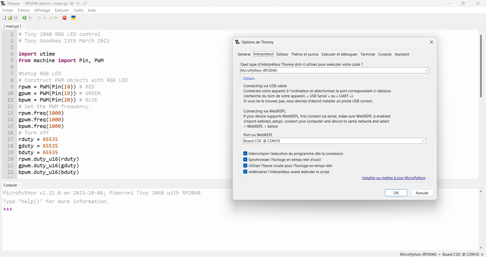

## TINY2040


Source [Pimoroni](https://shop.pimoroni.com/products/tiny-2040){target=_blank}

<center>
<iframe width="560" height="315" src="https://www.youtube-nocookie.com/embed/KmEyrOTYYCA?si=WERc_FdloYTNHino" title="YouTube video player" frameborder="0" allow="accelerometer; autoplay; clipboard-write; encrypted-media; gyroscope; picture-in-picture; web-share" allowfullscreen></iframe>
</center>

### Démarrage en MicroPython

- Télécharger le firmeware adapté : <https://micropython.org/download/PIMORONI_TINY2040/>{target=_blank}
- Maintenir appuyé le bouton `BOOT` tout en connectant l'USB au PC ;
- Glisser/déposer le fichier du firmware sur le lecteur `RPI-RP2 (E:)` ;


> [Source](https://www.raspberrypi.com/documentation/microcontrollers/micropython.html#drag-and-drop-micropython){target=_blank}

- Démarrer le logiciel `Thonny` puis cliquer dans le menu sur `Exécuter` pour choisir le bon interpréteur et le port connecté ;

{.center width=80%}

- Enregistrer en `main.py` le code suivant pour tester la LED RGB :

```Python
# Tiny 2040 RBG LED control
# Tony Goodhew 11th March 2021

import utime
from machine import Pin, PWM

#Setup RGB LED
# Construct PWM objects with RGB LED
rpwm = PWM(Pin(18)) # RED
gpwm = PWM(Pin(19)) # GREEN
bpwm = PWM(Pin(20)) # BLUE
# Set the PWM frequency.
rpwm.freq(1000)
gpwm.freq(1000)
bpwm.freq(1000)
# Turn off
rduty = 65535
gduty = 65535
bduty = 65535
rpwm.duty_u16(rduty)
gpwm.duty_u16(gduty)
bpwm.duty_u16(bduty)

def LED(r,g,b):
    rduty = int(65535 -(65535 * r/255))
    gduty = int(65535 -(65535 * g/255))
    bduty = int(65535 -(65535 * b/255))
#    print(rduty)
#    print(gduty)
#    print(bduty)
    rpwm.duty_u16(rduty)
    gpwm.duty_u16(gduty)
    bpwm.duty_u16(bduty)
    
LED(255,255,255)
utime.sleep(0.3)
LED(255,0,0)
utime.sleep(0.3)
# Blink
for i in range(4):
    LED(0,0,255)
    utime.sleep(0.3)
    LED(0,0,0)
    utime.sleep(0.3)
# Fade UP
for i in range(255):
    LED(i,i,0)
    utime.sleep(0.01)
# Fade DOWN
for ii in range(255,-1,-1):
    LED(ii,ii,0)
    utime.sleep(0.01)

```
> [Source](https://forums.pimoroni.com/t/tiny-2040-rgb-led-control-tutorial/16604){target=_blank}


## MiniBot 


> [Source : SMARS MINI](https://www.kevsrobots.com/blog/smars-mini.html){target=_blank}

### Composants :

- [Mini L298N](https://fr.aliexpress.com/item/33012645746.html?spm=a2g0o.order_list.order_list_main.16.21ef5e5bXP3c8B&gatewayAdapt=glo2fra) ;

- [GY-530 VL53L0X le plus petit capteur de télémétrie laser Time-o f-flight (ToF) au monde](https://fr.aliexpress.com/item/32738458924.html?spm=a2g0o.order_list.order_list_main.21.21ef5e5bXP3c8B&gatewayAdapt=glo2fra)

- [Mini moteur à engrenages](https://fr.aliexpress.com/item/4000498187956.html?spm=a2g0o.order_list.order_list_main.26.21ef5e5bXP3c8B&gatewayAdapt=glo2fra)