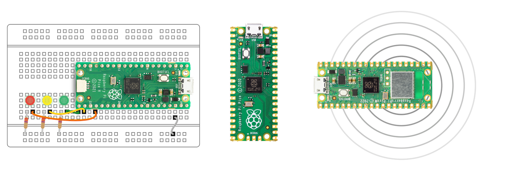

## Documentation RP2040

 <https://www.raspberrypi.com/documentation/microcontrollers/rp2040.html>{target=_blank} 

## [PI PICO](./PICO/)

{.center width=60%}

## [TINY](./TINY/)

{.center width=60%}

## Autres cartes RP2040

<https://www.tomshardware.com/best-picks/best-rp2040-boards>{target=_blank}